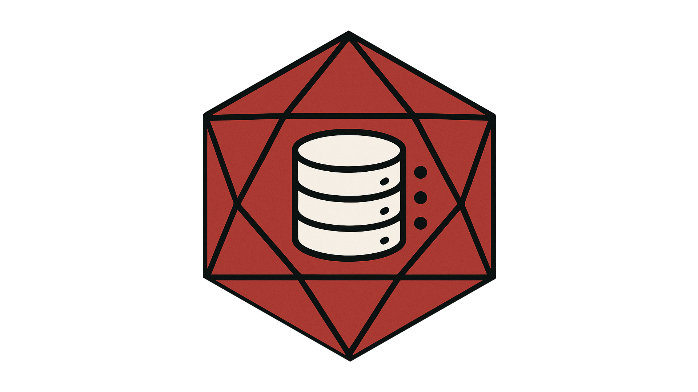

  

<h1 align="center">There and Stack Again: A Data Journey</h1>

Welcome! This repository is part of my personal portfolio as I learn and grow my skills in data analysis, Excel, SQL, and data storytelling. The goal of this project is to explore real-world data sets, apply analytical techniques, and communicate insights clearly and effectively.

---

## About This Project

If I stay the course, this should be a collection of projects and notebooks reflecting my journey into data analysis. Each section will include cleaned datasets, SQL queries, Excel dashboards, and ongoing documentation of what I’m learning.

Key skills I'm focusing on:
- Data cleaning and transformation (SQL, Excel)
- Exploratory data analysis (EDA)
- Data visualization (Excel charts, Tableau)
- Communicating insights clearly
- Version control with Git and GitHub

---

## Tools & Technologies

- **SQL** – PostgreSQL for querying structured data
- **Excel** – Pivot tables, charts, functions for EDA
- **Tableau / Power BI** – For visualization (when applicable)
- **Git & GitHub** – For version control and documentation
- **R** - For Data Exploration, Visualization
- **Python (soon)** – Planned expansion into scripting and automation

---

##  Intent

As someone transitioning into data analysis, I created this repository to:
- Practice working with real-world datasets
- Build a public portfolio for potential employers
- Document progress as I learn and grow
- Share resources that may help others starting out

---

##  Contributions & Feedback

This is a learning-first project, so constructive feedback is welcome! Please feel free to:
- Submit issues if you spot mistakes or have suggestions
- Fork and experiment with the data
- Share educational resources or feedback via issues or discussions

---

##  License

This project is licensed under the [MIT License](./LICENSE). You're free to use, modify, and share it—just give credit where it’s due!

---

Thanks for stopping by! May your prosperous travels always roll a natural 20.
